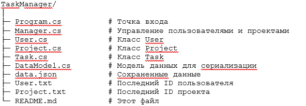
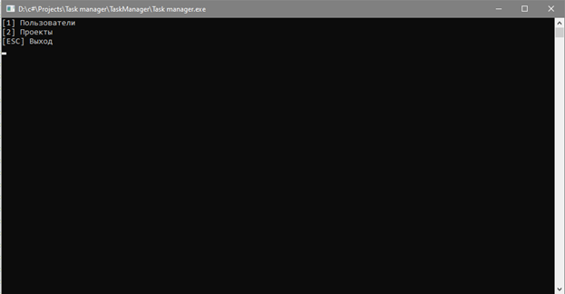
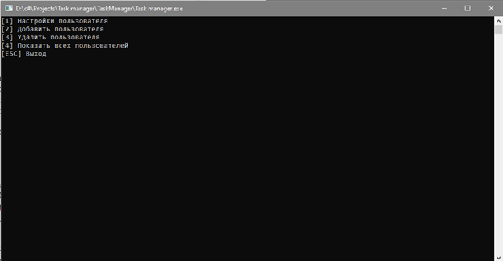
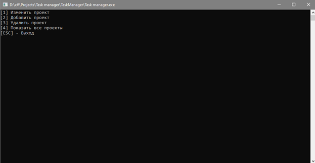

## Task Manager (Консольная система управления задачами)
## Описание
Программа позволяет:
•	Создавать проекты и задачи

•	Назначать задачи пользователям 

•	Удалять и редактировать задачи 

•	Сохранять данные в JSON-файлы и загружать их при старте 

•	Автоматически управлять ID пользователей, проектов и задач 

Простая и удобная система для отслеживания задач в консольном формате.

## Технологии
•	C# (.NET 6/7) 

•	System.Text.Json для сериализации 

•	Консольное меню с обработкой клавиш (ConsoleKey) 
                  
•	Файловое хранение данных (data.json, User.txt, Project.txt)	

## Структура проекта

## Особенности реализации
•	Автоинкремент ID для пользователей, проектов и задач 
•	Хранение последнего ID в отдельных текстовых файлах 
•	JSON-cериализация с корркетным сохранением списков пользователей и задач
•	JSON-десериализация с корректным восстановлением списков задач 
•	Проверка на дублирующиеся названия проектов и задач 

## Рисунок 1

На рисунке 1 изображено главное меню программы.

 
## Рисунок 2

На рисунке 2 изображено меню редактирования пользователей.

 
## Рисунок 3

На рисунке 3 изображено меню редактирования проектов.

## Контакты / Автор
Максим Квятковский
Email: kvyatkovskymaxim7@gmail.com

